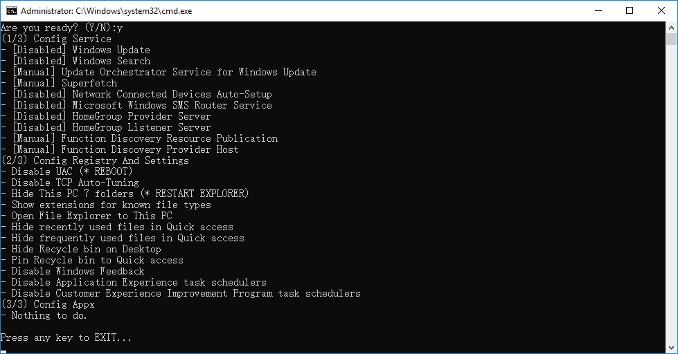

# WindowsDesktopOptimization

A bat script to auto config Windows 10 2016 LTSB

Run `Windows Desktop Optimization.bat` as Administrator:

## BAT Will Do:
* Config Service
  - \[Disabled] Windows Update
  - \[Disabled] Windows Search
  - \[Manual] Update Orchestrator Service for Windows Update
  - \[Manual] Superfetch
  - \[Disabled] Network Connected Devices Auto-Setup
  - \[Disabled] Microsoft Windows SMS Router Service
  - \[Disabled] HomeGroup Provider Server
  - \[Disabled] HomeGroup Listener Server
  - \[Manual] Function Discovery Resource Publication
  - \[Manual] Function Discovery Provider Host

* Config Registry and GroupPolicy
  - Disable UAC (NEED REBOOT)
  - Disable TCP Auto-Tuning
  - Hide This PC 6 folders
  - Show extensions for known file types
  - Open File Explorer to This PC
  - Hide recently used files in Quick access
  - Hide frequently used files in Quick access
  - Hide Recycle bin on Desktop
  - Pin Recycle bin to Quick access

* Config Appx (for other win10 version)
  - Remove XBox
  - Remove Zune
  - Remove Bing
